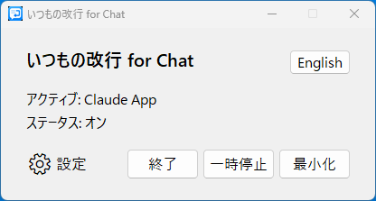
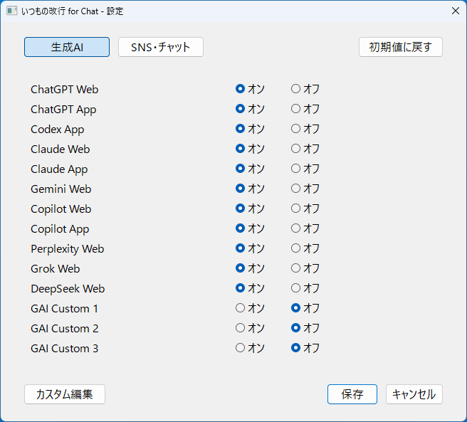
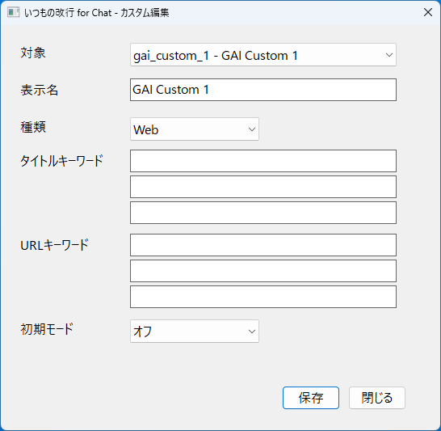

# いつもの改行 for Chat

生成AI、SNS、チャットアプリの入力欄で、Enterキーを入力欄内改行に置き換えるWindows常駐ツールです。

このツールは送信キーそのものの変更や送信操作の代替は行いません。変換するのは、入力欄内改行だけです。

<table>
  <tr>
    <td></td>
    <td></td>
  </tr>
  <tr>
    <td colspan="2"></td>
  </tr>
</table>

## ダウンロード

一般ユーザー向けの説明・最新版ダウンロードはこちらです。

https://bunjicompany.com/downloads/ItsumonoKaigyoForChat/

過去バージョン・更新履歴はこちらです。

https://github.com/bunjicompany/linebuddy-for-chat/releases

## 安全性について

このアプリは、入力した文章・パスワード・クリップボードの内容を読み取り・保存しません。
キー操作を変換するために必要な範囲で、現在のウィンドウ状態とキー入力イベントを判定します。
外部サーバーへの送信は行いません。

個人開発アプリのため、Windows SmartScreenの警告が表示される場合があります。

## 主な機能

- 生成AI、SNS、チャットの対象ごとにオン/オフを選択できます。
- Web版とApp版を分けて管理できます。
- 日本語IME変換中のEnterは、文字確定を優先します。
- タイトル、URL、プロセス名のキーワードで、ユーザー用のカスタム対象を追加できます。
- タスクトレイから一時停止、設定、言語切替、Windows起動時登録を操作できます。

## 初期プリセット

### 生成AI

- ChatGPT Web / App
- Codex App
- Claude Web / App
- Gemini Web
- Copilot Web / App
- Perplexity Web
- Grok Web
- DeepSeek Web

### SNS・チャット

- LINE App
- X Web
- Slack Web / App
- Discord Web / App
- Teams Web / App
- Instagram Web
- WhatsApp Web / App

## カスタム対象について

主要サービスは初期プリセットとして用意されています。
対象外のサービスや、画面構成・タブタイトル・URL・プロセス名が変わったサービスは、カスタム画面から新しい対象として追加できます。

カスタム画面で編集できるのは、ユーザーが追加したカスタム項目です。
既存のプリセット項目は、カスタム画面からは編集できません。

既存プリセットの判定条件を変更したい場合は、アプリを終了したあと、設定JSONファイルを直接編集してください。

## うまく動かないとき

- 対象アプリがオンになっているか確認してください。
- Web版の場合は、ブラウザのタブタイトルやURLが判定条件に合っているか確認してください。
- アプリ版の場合は、プロセス名が判定条件に合っているか確認してください。
- IME変換中のEnterは、改行ではなく変換確定を優先します。

設定がおかしくなった場合は、設定ファイルをバックアップしたうえで削除し、アプリを再起動してください。初期状態の設定ファイルが再作成されます。

## 設定ファイルについて

設定内容は `ItsumonoKaigyoForChat_settings.json` に保存されます。
exe版では、設定ファイルは `ItsumonoKaigyoForChat.exe` と同じフォルダに作成されます。

カスタム画面から編集できるのは、ユーザーが追加したカスタム項目です。
初期プリセット項目を変更したい場合は、アプリを終了したあと、設定JSONファイルを直接編集してください。

編集前に設定ファイルをバックアップしておくことをおすすめします。

## 開発・ビルド

```powershell
python -m venv .venv
.\.venv\Scripts\python.exe -m pip install -r requirements.txt
.\.venv\Scripts\python.exe -m PyInstaller --clean --noconfirm ItsumonoKaigyo.spec
```

または:

```powershell
.\build_exe.ps1
```

ビルド後、`dist\ItsumonoKaigyoForChat.exe` が生成されます。

## 主なファイル

- `itsumono_kaigyo.py`: アプリ本体
- `ItsumonoKaigyo.spec`: PyInstaller設定
- `app_icon.ico`: アプリアイコン
- `ItsumonoKaigyoForChat_settings.json`: 設定ファイル
