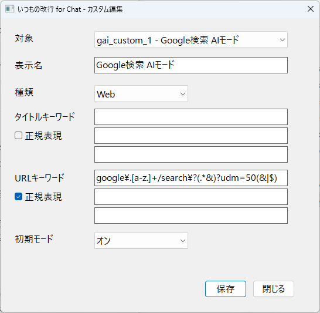

# いつもの改行 for Chat

生成AI、SNS、チャットアプリの入力欄で、Enterキーを入力欄内改行に置き換えるWindows常駐ツールです。

このツールは送信キーそのものの変更や送信操作の代替は行いません。変換するのは、入力欄内改行だけです。

<table>
  <tr>
    <td></td>
    <td></td>
  </tr>
  <tr>
    <td colspan="2"></td>
  </tr>
</table>

## ダウンロード

一般ユーザー向けの説明・最新版ダウンロードはこちらです。

https://bunjicompany.com/downloads/ItsumonoKaigyoForChat/

過去バージョン・更新履歴はこちらです。

https://github.com/bunjicompany/linebuddy-for-chat/releases

## 安全性について

このアプリは、入力した文章・パスワード・クリップボードの内容を読み取り・保存しません。
キー操作を変換するために必要な範囲で、現在のウィンドウ状態とキー入力イベントを判定します。
外部サーバーへの送信は行いません。

個人開発アプリのため、Windows SmartScreenの警告が表示される場合があります。

## 主な機能

- 生成AI、SNS、チャットの対象ごとにオン/オフを選択できます。
- Web版とApp版を分けて管理できます。
- 日本語IME変換中のEnterは、文字確定を優先します。
- タイトル、URL、プロセス名のキーワードで、ユーザー用のカスタム対象を追加できます。
- タイトル、URL、プロセス名の判定条件は、項目ごとに正規表現モードに切り替えられます。
- Web対象として扱うブラウザのプロセス名を設定JSONから追加・変更できます。
- Sleipnirのようにキー入力を再送出するブラウザにも、Shiftラップ方式で安定して対応します。
- タスクトレイから一時停止、設定、言語切替、Windows起動時登録を操作できます。

## 初期プリセット

### 生成AI

- ChatGPT Web / App
- Codex App
- Claude Web / App
- Gemini Web
- Copilot Web / App
- Perplexity Web
- Grok Web
- DeepSeek Web
- Agent i Web

### SNS・チャット

- LINE App
- X Web
- Slack Web / App
- Discord Web / App
- Teams Web / App
- Instagram Web
- WhatsApp Web / App

## カスタム対象について

主要サービスは初期プリセットとして用意されています。
対象外のサービスや、画面構成・タブタイトル・URL・プロセス名が変わったサービスは、カスタム画面から新しい対象として追加できます。

初期プリセットは誤判定を避けるため、タイトルキーワードを使わない設定で保存されます。Web版は主にURL、App版は主にプロセス名で判定します。

カスタム画面で編集できるのは、ユーザーが追加したカスタム項目です。
既存のプリセット項目は、カスタム画面からは編集できません。

既存プリセットの判定条件を変更したい場合は、アプリを終了したあと、設定JSONファイルを直接編集してください。

## 正規表現モードについて

タイトルキーワード、URLキーワード、プロセス名は、それぞれ正規表現モードに切り替えられます。

- カスタム画面では、各入力欄の「正規表現」チェックボックスで切り替えます。
- オフのとき（既定）は従来どおりの判定です。タイトルとURLは部分一致、プロセス名は完全一致です。
- オンのときは各値を正規表現として解釈します。タイトルとURLは部分一致検索（search）、プロセス名は完全一致（fullmatch）で、いずれも大文字小文字を区別しません。
- 複数の値を設定した場合は、いずれか1つに一致すれば対象と判定されます（OR条件）。
- 不正な正規表現は、カスタム画面では保存時にエラーになります。設定JSONを直接編集した場合は、そのパターンだけ無視されます。

既存プリセットを正規表現モードにしたい場合は、設定JSONファイルの `window_title_keywords_regex` / `url_keywords_regex` / `processes_regex` を `true` に変更してください。

### 設定例：Google検索のAIモードを対象にする

Google検索のAIモードはURLのクエリに `udm=50` が付くため、正規表現を使うとAIモードのページだけを対象にできます。カスタム編集画面で次のように設定します。

- 対象: `gai_custom_1`（表示名は任意。例: `Google検索 AIモード`）
- 種類: `Web`
- URLキーワード: `google\.[a-z.]+/search\?(.*&)?udm=50(&|$)`（正規表現: オン）
- 初期モード: オン



通常のGoogle検索（`udm=50` なし）では変換されず、AIモードの入力欄でのみEnterが入力欄内改行になります。

## うまく動かないとき

- 対象アプリがオンになっているか確認してください。
- Web版の場合は、ブラウザのタブタイトルやURLが判定条件に合っているか確認してください。
- アプリ版の場合は、プロセス名が判定条件に合っているか確認してください。
- IME変換中のEnterは、改行ではなく変換確定を優先します。

設定がおかしくなった場合は、設定ファイルをバックアップしたうえで削除し、アプリを再起動してください。初期状態の設定ファイルが再作成されます。

## 設定ファイルについて

設定内容は `ItsumonoKaigyoForChat_settings.json` に保存されます。
exe版では、設定ファイルは `ItsumonoKaigyoForChat.exe` と同じフォルダに作成されます。

カスタム画面から編集できるのは、ユーザーが追加したカスタム項目です。
初期プリセット項目を変更したい場合は、アプリを終了したあと、設定JSONファイルを直接編集してください。

各対象の `window_title_keywords_regex` / `url_keywords_regex` / `processes_regex`（初期値はすべて `false`）を `true` にすると、対応する値が正規表現として解釈されます。

### 対応ブラウザを追加・変更する

Web対象として判定するブラウザは、設定JSONファイルの `browser_processes` で変更できます。

初期状態では、次のブラウザをWeb対象として扱います。

- Google Chrome
- Microsoft Edge
- Mozilla Firefox
- Brave
- Opera
- Vivaldi
- Fenrir Sleipnir

```json
"browser_processes": [
  "chrome.exe",
  "msedge.exe",
  "firefox.exe",
  "brave.exe",
  "opera.exe",
  "vivaldi.exe",
  "sleipnir.exe"
]
```

`chromium_browser_processes` は、Chrome系ブラウザとしてアドレスバー判定を行うプロセス名の一覧です。追加したブラウザがChromium系で、アドレスバー入力中の誤変換を避けたい場合は、こちらにも同じプロセス名を追加してください。

```json
"chromium_browser_processes": [
  "chrome.exe",
  "msedge.exe",
  "brave.exe",
  "opera.exe",
  "vivaldi.exe",
  "sleipnir.exe"
]
```

`shift_enter_wrap_processes` では、「Shiftラップ方式」で変換するプロセスを指定できます。この方式では、Enterを押した時点でShiftキーを押し込み、Enterキー自体はそのまま通します（合成のShift+Enterは送りません）。Enterを離した後、少し遅れてShiftを解放します。Sleipnirのようにキー入力を取り込んで再送出するブラウザでは、合成したShift+Enterが再送出のタイミング次第で失われることがあるため、この方式を使います。初期値は `sleipnir.exe` です。

```json
"shift_enter_wrap_processes": [
  "sleipnir.exe"
]
```

旧設定キー `shift_enter_send_on_keydown_processes` は起動時に `shift_enter_wrap_processes` へ自動移行されます。旧キー `shift_enter_send_method_by_process` は廃止され、無視されます。

プロセス名は大文字小文字を区別しません。`.exe` を省略しても、保存時に `.exe` 付きへ正規化されます。

編集前に設定ファイルをバックアップしておくことをおすすめします。

## 開発・ビルド

```powershell
python -m venv .venv
.\.venv\Scripts\python.exe -m pip install -r requirements.txt
.\.venv\Scripts\python.exe -m PyInstaller --clean --noconfirm ItsumonoKaigyo.spec
```

または:

```powershell
.\build_exe.ps1
```

ビルド時に `APP_VERSION` が自動更新されます。既定では patch が 1 つ上がります。

```powershell
.\build_exe.ps1 -VersionBump patch
.\build_exe.ps1 -VersionBump minor
.\build_exe.ps1 -VersionBump major
.\build_exe.ps1 -VersionBump none
```

ビルド後、`dist\ItsumonoKaigyoForChat.exe` が生成されます。

## 主なファイル

- `itsumono_kaigyo.py`: アプリ本体
- `ItsumonoKaigyo.spec`: PyInstaller設定
- `app_icon.ico`: アプリアイコン
- `ItsumonoKaigyoForChat_settings.json`: 設定ファイル
